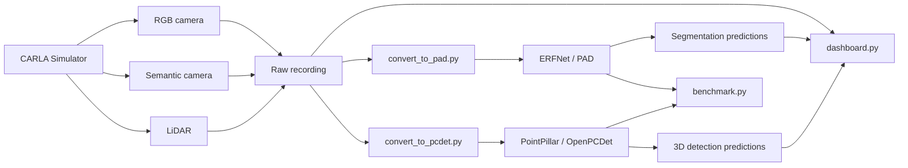

# CARLA Perception Lab

A reproducible, simulator-based perception pipeline for autonomous driving research:
**CARLA data acquisition -> semantic segmentation (ERFNet) + LiDAR 3D detection (PointPillar) -> synchronized dashboard -> benchmark and offline inference packaging**.

## Abstract
This repository presents a practical integration of camera-based semantic segmentation and LiDAR-based 3D object detection on synthetic CARLA data. The implementation emphasizes reproducibility under constrained hardware (RTX 4060 Laptop 8GB), stage-wise validation, and explicit reporting of assumptions/failure modes. The scope is perception only; no planning or control components are included.

## Demo Preview
<p align="center">
  
</p>
<p align="center"><sub>Updated using verified V1 epoch-33 detection outputs (2026-05-16).</sub></p>

## Scope and Contributions
- End-to-end multi-modal perception workflow from CARLA recording to synchronized visualization.
- Two integrated model paths:
  - Semantic segmentation: ERFNet via PytorchAutoDrive.
  - 3D detection: PointPillar via OpenPCDet.
- Canonicalized data interfaces for both frameworks.
- Benchmarking utilities with latency/FPS/VRAM and evaluation metric aggregation.
- Local offline inference/deployment scripts for reproducible execution without active CARLA runtime.

## System Overview


## Experimental Setup
### Hardware
- Laptop: ASUS ROG Zephyrus G16
- CPU: Intel Core i7-13620H
- GPU: NVIDIA RTX 4060 Laptop (8GB VRAM)
- RAM: 32GB
- OS: Linux Mint 22.2 (Ubuntu 24.04 base)

### Data Regime
- Simulator: CARLA (synthetic data only)
- Modalities: RGB, semantic mask, LiDAR point cloud, per-frame metadata
- Canonical stage datasets:
  - `data/raw/stage03_mine_main_1000`
  - `data/raw/stage03_mine_aux_200_traffic_far`

### Models
- Segmentation: ERFNet checkpoint (`data/checkpoints/erfnet_cityscapes_512x1024_20200918.pt`)
- Detection: PointPillar checkpoint (`data/checkpoints/pointpillar_7728.pth` or fine-tuned variant)

## Reproducibility
### 1) Environment validation
```bash
bash scripts/setup_envs_stage01.sh --help
bash scripts/check_envs.sh
```

### 2) Full hardened pipeline (Stage 03 -> 09)
```bash
bash run_all_stages_hardened.sh --help
```

### 3) Stage-wise commands
Dataset recording:
```bash
conda run -n carla-client python scripts/carla_recorder.py \
  --config configs/sensor_config.yaml \
  --map Mine_01 \
  --output-dir data/raw/stage03_mine_main_1000 \
  --num-frames 1000 \
  --overwrite
```

Segmentation:
```bash
conda run -n pad python scripts/run_segmentation.py \
  --mode infer_and_evaluate \
  --image-dir data/processed/pad_format_stage08_canonical_mix_val/images \
  --gt-dir data/processed/pad_format_stage08_canonical_mix_val/masks \
  --pred-dir output/segmentation/predictions \
  --overlay-dir output/segmentation/overlays \
  --eval-output output/segmentation_canonical_mix_val/eval_results.json \
  --batch-size 1 \
  --mixed-precision \
  --save-overlays \
  --overwrite
```

LiDAR detection:
```bash
conda run -n pcdet python scripts/run_lidar_det.py \
  --mode infer_and_evaluate \
  --cfg-file configs/carla_lidar_probe.yaml \
  --checkpoint data/checkpoints/pointpillar_7728.pth \
  --dataset-dir data/processed/pcdet_format_stage08_canonical_mix \
  --split val \
  --batch-size 1 \
  --pred-dir output/detection_3d/predictions \
  --eval-output output/detection_3d_canonical_mix/eval_results.json \
  --overwrite
```

Dashboard rendering:
```bash
python scripts/make_dashboard.py \
  --mode both \
  --fps 10 \
  --overwrite \
  --report-json output/dashboard/dashboard_report.json
```

Offline inference packaging:
```bash
bash scripts/deploy_local.sh --help
bash run_demo.sh --help
```

## Quantitative Results (Stage 10)
Source artifact: `output/benchmark/benchmark_report.md` (generated on 2026-05-13).

| Metric | ERFNet (Segmentation) | PointPillar (3D Detection) |
|---|---:|---:|
| Checkpoint size | 8.03 MB | 55.40 MB |
| Parameters | 2.073 M | 4.841 M |
| Wall FPS (mean +/- std) | 9.38 +/- 0.12 | 8.07 +/- 0.05 |
| Wall latency ms/frame (mean +/- std) | 106.58 +/- 1.38 | 123.96 +/- 0.79 |
| Forward FPS (mean +/- std) | 22.11 +/- 0.46 | 28.07 +/- 0.22 |
| Forward latency ms (mean +/- std) | 45.24 +/- 0.93 | 35.63 +/- 0.28 |
| Peak VRAM (MiB, max) | 2273 | 2444 |
| Accuracy metric | mIoU=0.0573 | mAP=0.0030 |

## Artifact Index
- Stage reports (latest): `docs/stage_reports/STAGE_11_REPORT.md`, `docs/stage_reports/STAGE_12_REPORT.md`
- Stage reports (archive): `docs/stage_reports/archive/STAGE_00_REPORT.md` ... `docs/stage_reports/archive/STAGE_10_REPORT.md`
- Deployment guide: `docs/deployment.md`
- Offline deployment notes: `deploy/DEPLOY_README.md`
- Benchmark outputs: `output/benchmark/`

## Limitations and Validity Notes
- Town10 acquisition remains unstable on this runtime (see `docs/stage_reports/DATASET_QUARANTINE.md`).
- Current metrics indicate the pipeline is operational but not accuracy-optimized.
- Reported wall-clock throughput includes I/O and wrapper overhead.
- Synthetic-only data regime; conclusions may not transfer to real-world distributions.

## Safety Statement
This repository is for simulator-based research and software engineering demonstration only.
It is not intended or validated for real-road, safety-critical, or production autonomous driving deployment.

## License
MIT License. See `LICENSE`.

## Acknowledgements
- CARLA Simulator: https://carla.org/
- PytorchAutoDrive: https://github.com/voldemortX/pytorch-auto-drive
- OpenPCDet: https://github.com/open-mmlab/OpenPCDet
