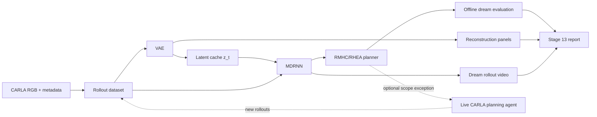

# Stage 13 - Evolutionary Planning in Latent Space Integration Plan

**Paper**: Olesen et al., "Evolutionary Planning in Latent Space", arXiv:2011.11293  
**Reference code**: https://github.com/two2tee/WorldModelPlanning  
**Target project**: `carla-perception-lab`  
**Last updated**: 2026-05-19  
**Status**: proposed research extension, no implementation yet

---

## Executive Decision

Stage 13 is feasible, but it has two different scopes:

| Mode | What it delivers | Compatibility with current project scope | Recommendation |
|---|---|---|---|
| **13A - Offline world model** | VAE, MDRNN, reward model, dream rollouts, offline RMHC/RHEA evaluation, dashboard panels | Compatible with the current perception-first scope | Implement first |
| **13B - Simulator closed-loop planner** | RMHC/RHEA controls ego vehicle in CARLA and collects new planning-policy rollouts | Requires an explicit exception to `PLAN.md` Non-Goals | Optional after 13A passes |
| **13C - Paper-scale reproduction** | Near paper-scale iterative training, many rollouts, repeated live evaluation | Outside the original repo constraints and expensive on this laptop | Not default |

**Answer to the scope question**: yes, you can relax the constraints if the goal is to satisfy the paper more faithfully, but do not remove all constraints. The correct change is a narrow Stage 13 exception:

```text
Allow simulator-only model-based planning/control for Stage 13 research experiments.
Still prohibit end-to-end policy learning, model-free RL driving agents, real-road deployment,
production driving claims, and concurrent CARLA + training workloads on the RTX 4060.
```

Keeping the original perception-only rules means Stage 13 can still showcase the paper through offline world-model learning and latent-space planning, but it cannot fully reproduce the paper's online planning loop because EPLS executes the first planned action in the real environment and then replans.

---

## Scope Amendment Required for Paper-Faithful EPLS

The paper is a model-based reinforcement learning / planning method for a continuous control task. The live EPLS loop needs `(observation, action, reward, terminal)` rollouts and executes planned actions in the environment. That conflicts with the current README and `PLAN.md` statements that the repository has no planning/control components and excludes reinforcement-learning driving agents.

Use this table as the exact rule change:

| Existing constraint | Stage 13 decision | Reason |
|---|---|---|
| "The scope is perception only; no planning or control components are included." | Relax only for Stage 13B, and label it as a simulator-only research extension | EPLS is explicitly a planning method |
| "Full autonomous driving stack" is a Non-Goal | Keep | Stage 13 must not become routing, behavior planning, prediction, localization, ROS, Autoware, or a production stack |
| "End-to-end policy learning" is a Non-Goal | Keep | EPLS plans with a learned world model; it does not train an end-to-end policy network |
| "Reinforcement learning driving agent" is a Non-Goal | Narrow the wording for Stage 13: prohibit model-free/end-to-end RL agents, allow model-based latent-space planning in CARLA | Paper-faithful iterative EPLS is model-based RL/planning |
| "Real-road vehicle deployment" is a Non-Goal | Keep | No real vehicle control, no safety-critical claims |
| "Do not run CARLA simulator and OpenPCDet training at the same time" | Keep and extend to world-model training | The RTX 4060 8GB budget is tight |
| "Keep datasets small for MVP: 1000-5000 frames" | Relax progressively for Stage 13 after smoke tests pass | MDRNN needs sequential rollout diversity; paper-scale data is much larger |

Recommended wording to later add to `PLAN.md` if Stage 13B is approved:

```text
Stage 13 exception: simulator-only model-based world-model planning is allowed as a
research extension. This exception does not allow real-road deployment, production
autonomous driving claims, end-to-end policy learning, model-free RL agents, ROS /
Autoware / Apollo integration, or concurrent CARLA + model-training workloads.
```

---

## Paper Ground Truth

These are the paper facts that should anchor the implementation:

| Topic | Paper detail | Stage 13 adaptation |
|---|---|---|
| Environment | `CarRacing-v0`, continuous control | CARLA simulator, not an exact benchmark match |
| Observation | RGB frames resized to `64x64x3` | Resize CARLA RGB frames to 64x64 for the paper-faithful path; optionally test 96x96 or 128x128 later |
| Latent size | `z_dim = 64` | Use 64 first |
| Actions | 3 continuous values: steering, acceleration, braking | Use `[steer, throttle, brake]`; store reverse/hand_brake only as metadata |
| VAE | ConvVAE with 4 conv/deconv layers | Implement locally in PyTorch; do not depend on old paper repo runtime |
| MDRNN | LSTM with 512 hidden units and 5 Gaussian mixtures | Start with 256 hidden units for smoke tests; restore 512 for paper-grade runs if VRAM allows |
| World-model targets | Next latent state, reward, terminal | Store and train all three; VAE-only is not enough for EPLS |
| MDRNN loss | GMM negative log-likelihood + reward MSE + terminal BCE | Implement as explicit metrics |
| Non-iterative data | 10,000 random rollouts, `T = 500` | Too large as default for this laptop; use staged scaling |
| Iterative data | 500 rollouts per iteration, `T = 250`, five iterations in the reported experiment | Use as Stage 13B/13C target after 13A passes |
| VAE training | 50 epochs, Adam, `lr = 1e-4` | Use 50 for final runs; smoke tests can use 3-10 |
| MDRNN training | 60 epochs, Adam, `lr = 1e-3` | Use 60 for final runs; smoke tests can use 3-10 |
| RMHC | Shift-buffered rolling-horizon search | Required for the paper-faithful planner |
| RMHC horizon/generations | Baseline horizon 20, 10 generations; 15 generations improved results; horizon beyond 20 gave diminishing returns | Use horizon 20 and 10 generations as default; sweep `{5, 10, 15}` generations and `{5, 10, 20}` horizon |

Important interpretation: porting the architecture is not enough. To satisfy the paper's core claim, Stage 13 must demonstrate that planning over the learned latent dynamics improves an action-selection baseline, at least in dreamed rollouts and ideally in CARLA closed loop.

---

## Feasibility Summary

| Component | Current project status | Feasibility | Notes |
|---|---|---|---|
| RGB observations | Available from Stage 03 recorder | High | Existing `configs/sensor_config.yaml` already uses 320x180, easy to downsample |
| Control/action recording | Not present | High | Add `ego_vehicle.get_control()` to metadata |
| Reward signal | Not present | Medium | Must be engineered from CARLA telemetry and events |
| Terminal signal | Not present | Medium | Use collision, stuck timeout, off-road/lane-invasion thresholds, rollout end |
| VAE | Not present | High | Self-contained PyTorch module |
| Latent dataset | Not present | High | Build from recorded RGB frames and VAE checkpoints |
| MDRNN | Not present | Medium | Most complex model component |
| RMHC/RHEA | Not present | Medium | Algorithm is straightforward; evaluation quality depends on reward/world model |
| Live CARLA planner | Not present | Medium/High | Requires scope exception, stable synchronous stepping, and careful GPU scheduling |
| Iterative refinement | Not present | High | Paper-faithful but expensive and operationally fragile |
| Dashboard extension | Existing dashboard available | High | Add reconstruction, dream, and planning metric panels |

---

## What Can and Cannot Be Integrated

### Safe Default: Stage 13A

Stage 13A stays close to the current repository intent:

1. Extend recording metadata with actions, reward inputs, and terminal flags.
2. Train a ConvVAE on CARLA RGB frames.
3. Encode recorded frames into latent vectors.
4. Train an MDRNN on recorded rollouts.
5. Run RMHC/RHEA inside the learned model only.
6. Generate dream videos and dashboard panels.
7. Report world-model quality and planner-vs-random predicted reward.

This mode demonstrates the EPLS pipeline without allowing the planner to control CARLA.

### Paper-Faithful Extension: Stage 13B

Stage 13B is needed if the goal is to run the method in the way the paper describes:

1. Use the VAE and MDRNN at runtime.
2. At each CARLA tick, encode current RGB to `z_t`.
3. Use RMHC/RHEA to search an action sequence in latent space.
4. Apply the first action to the ego vehicle.
5. Observe the next CARLA state, reward, and terminal.
6. Store the rollout and periodically retrain the MDRNN.

This is still simulator-only and research-grade, but it crosses from perception into planning/control. It should be opt-in and documented as a scope exception.

### Not Recommended

The following should remain out of scope:

- Real-road or production deployment.
- End-to-end policy learning from pixels to controls.
- Model-free RL baselines such as DQN/A3C/PPO for CARLA driving.
- Full autonomous-driving stack scope: routing, HD maps, behavior planning, ROS, Autoware, Apollo.
- Training large 3D perception models while CARLA is running.
- Claiming performance equivalence to the paper's `CarRacing-v0` benchmark. CARLA is a different environment.

---

## CARLA Adaptation Design

### Observation

Use only the forward RGB camera for the paper-faithful world model:

```text
CARLA RGB frame: 320x180 or 1280x720
-> crop/resize: 64x64
-> normalize: float32 [0, 1]
-> VAE encoder: z_dim = 64
```

Segmentation and LiDAR should not be fused into the first world model. They can be used later for reward shaping or dashboard diagnostics, but multimodal latent fusion is a separate research problem and would make Stage 13 harder to debug.

### Action

Store actions in this canonical order:

```text
action = [steer, throttle, brake]
steer    in [-1.0, 1.0]
throttle in [0.0, 1.0]
brake    in [0.0, 1.0]
```

For initial data collection, prefer CARLA autopilot plus small exploration noise over fully random control. Fully random steering/throttle/brake in CARLA tends to create low-quality rollouts dominated by collisions, stuck states, or off-road behavior. The paper could use random policy because `CarRacing-v0` resets cheaply and has a compact track task; CARLA needs a more controlled dataset curriculum.

### Reward

A practical CARLA reward should be simple, inspectable, and derived from metadata:

```python
reward = 0.0
reward += progress_m * 1.0
reward += min(speed_kmh / 40.0, 1.0) * 0.05
reward -= collision_intensity * 5.0
reward -= float(lane_invasion) * 1.0
reward -= float(offroad) * 2.0
reward -= abs(steer_delta) * 0.02
reward -= float(stuck) * 0.5
```

Do not overfit reward design in the first pass. The first success criterion is not beautiful driving; it is whether the MDRNN can learn reward/terminal trends well enough for RMHC to beat a random action-sequence baseline in the learned model.

### Terminal

Set `done = true` when any of these occur:

- Collision above configured intensity threshold.
- Ego vehicle is stuck below a speed threshold for a configured number of frames.
- Off-road/lane-invasion state persists for a configured number of frames.
- CARLA actor becomes invalid or recorder loses synchronization.
- The rollout reaches its configured length.

### Dataset Scale

Use staged scaling rather than jumping directly to paper scale:

| Tier | Rollouts | Frames per rollout | Purpose |
|---|---:|---:|---|
| Smoke | 5-10 | 100-200 | Validate schema, dataloaders, losses, and commands |
| MVP | 50-100 | 250-500 | Produce usable VAE/MDRNN and dream videos |
| Research | 250-500 | 250 | Attempt iterative training |
| Paper-scale reference | 10,000 | 500 | Not recommended on this machine as a default target |

---

## Proposed Architecture



---

## Data Schema

Extend each per-frame metadata JSON with the fields below. Existing keys should remain backward compatible.

```json
{
  "frame_id": 42,
  "timestamp": 12.34,
  "sensor_frames": {
    "rgb_camera": 42,
    "semantic_camera": 42,
    "lidar": 42
  },
  "ego_vehicle": {
    "location": {"x": 0.0, "y": 0.0, "z": 0.0},
    "rotation": {"pitch": 0.0, "yaw": 0.0, "roll": 0.0},
    "velocity": {"x": 0.0, "y": 0.0, "z": 0.0},
    "acceleration": {"x": 0.0, "y": 0.0, "z": 0.0}
  },
  "control": {
    "steer": -0.05,
    "throttle": 0.55,
    "brake": 0.0,
    "reverse": false,
    "hand_brake": false,
    "manual_gear_shift": false
  },
  "telemetry": {
    "speed_kmh": 32.4,
    "progress_m": 0.8,
    "collision_intensity": 0.0,
    "lane_invasion": false,
    "offroad": false,
    "stuck": false
  },
  "world_model": {
    "reward": 0.13,
    "done": false,
    "done_reason": null
  }
}
```

Also write a rollout-level manifest:

```json
{
  "rollout_id": "rollout_00042",
  "policy": "autopilot_noise",
  "map": "Mine_01",
  "weather": "ClearNoon",
  "frames": 500,
  "action_order": ["steer", "throttle", "brake"],
  "reward_version": "carla_progress_v1",
  "terminal_version": "carla_terminal_v1"
}
```

---

## Implementation Plan

### Phase 0 - Scope Gate and Config

**Goal**: make the Stage 13 operating mode explicit before code starts.

Tasks:

1. Add `configs/world_model.yaml`.
2. Add a `stage13.mode` setting with values `offline`, `live_planning`, and `iterative`.
3. Document that only `offline` is compatible with the original perception-only scope.
4. If `live_planning` or `iterative` is used, require a `--allow-stage13-control` CLI flag.

Exit criteria:

- `configs/world_model.yaml` validates.
- Commands fail clearly if live control is requested without the explicit flag.

### Phase 1 - Rollout Recording Extension

**Goal**: record synchronized `(state, action, reward, done)` data.

Files:

| File | Action |
|---|---|
| `scripts/carla_recorder.py` | Modify metadata writer to include control, telemetry, reward, and terminal fields |
| `configs/sensor_config.yaml` | Add optional collision and lane-invasion sensors or event settings |
| `scripts/collect_rollouts.py` | Create batch rollout wrapper with retry/resume support |
| `src/world_model/reward.py` | Create reward and terminal utilities |
| `tests/test_world_model_reward.py` | Create deterministic reward/terminal tests |

Exit criteria:

- 5 smoke rollouts record successfully.
- Every frame has aligned RGB, metadata, control, reward, and done values.
- Rollout manifests are written.
- Dataset integrity check catches missing frames and unsynchronized sensor frames.

### Phase 2 - VAE Training and Latent Cache

**Goal**: train the visual component and cache latent vectors.

Files:

| File | Action |
|---|---|
| `src/world_model/vae.py` | Create ConvVAE |
| `src/world_model/vae_dataset.py` | Create frame dataset with resize/normalization |
| `src/world_model/vae_trainer.py` | Create training loop |
| `scripts/train_vae.py` | Create CLI |
| `scripts/encode_rollouts.py` | Create latent cache CLI |
| `tests/test_vae.py` | Create shape and loss tests |

Default config:

```yaml
vae:
  image_size: 64
  channels: 3
  latent_size: 64
  batch_size: 32
  learning_rate: 0.0001
  epochs_smoke: 3
  epochs_final: 50
  kl_weight: 1.0
```

Exit criteria:

- Forward pass returns `(reconstruction, mu, logvar)` with expected shapes.
- Training runs on smoke data without OOM.
- Reconstruction grid is written to `output/world_model/vae/recon_grid.png`.
- Latent cache stores one `z` per RGB frame.

### Phase 3 - MDRNN World Model

**Goal**: learn latent dynamics, reward, and terminal prediction.

Files:

| File | Action |
|---|---|
| `src/world_model/mdrnn.py` | Create LSTM + MDN heads |
| `src/world_model/mdrnn_dataset.py` | Create sequence dataset from latent cache + metadata |
| `src/world_model/mdrnn_loss.py` | Create GMM-NLL + reward MSE + done BCE |
| `src/world_model/mdrnn_trainer.py` | Create training loop |
| `scripts/train_mdrnn.py` | Create CLI |
| `tests/test_mdrnn.py` | Create shape/loss tests |

Default config:

```yaml
mdrnn:
  latent_size: 64
  action_size: 3
  hidden_size_smoke: 256
  hidden_size_final: 512
  num_gaussians: 5
  sequence_length_smoke: 100
  sequence_length_final: 250
  batch_size: 1
  learning_rate: 0.001
  epochs_smoke: 3
  epochs_final: 60
```

Exit criteria:

- MDRNN forward pass emits mixture parameters, reward prediction, done logits, and next hidden state.
- Loss terms are logged separately.
- Validation GMM-NLL, reward MSE, and done BCE are reported.
- `scripts/dream_rollout.py` can decode a short latent rollout into video frames.

### Phase 4 - Latent-Space Planning

**Goal**: implement evolutionary planning over the learned MDRNN.

Files:

| File | Action |
|---|---|
| `src/world_model/planners/base.py` | Create common planner interface |
| `src/world_model/planners/rmhc.py` | Create shift-buffered RMHC |
| `src/world_model/planners/rhea.py` | Create optional population-based RHEA |
| `scripts/run_planner.py` | Create offline planner evaluation CLI |
| `tests/test_planners.py` | Create deterministic planner tests with a toy world model |

Default config:

```yaml
planner:
  action_order: ["steer", "throttle", "brake"]
  horizon: 20
  generations: 10
  generation_sweep: [5, 10, 15]
  horizon_sweep: [5, 10, 20]
  mutation_std:
    steer: 0.15
    throttle: 0.10
    brake: 0.10
  action_bounds:
    steer: [-1.0, 1.0]
    throttle: [0.0, 1.0]
    brake: [0.0, 1.0]
```

Exit criteria:

- RMHC beats random action sequences on predicted reward in the learned model.
- Planner evaluation writes JSON metrics and a rollout visualization.
- Horizon/generation sweep is recorded for the stage report.

### Phase 5 - Dashboard and Report

**Goal**: make Stage 13 inspectable.

Files:

| File | Action |
|---|---|
| `scripts/make_dashboard.py` or `scripts/dashboard.py` | Modify only if current dashboard entry point supports extension cleanly |
| `scripts/visualize_latent_space.py` | Create PCA/t-SNE visualization |
| `docs/stage_reports/STAGE_13_REPORT.md` | Create final report |

Dashboard panels:

```text
Current RGB | VAE reconstruction
Seg overlay | LiDAR BEV
Dream future | World-model metrics / planner trace
```

Exit criteria:

- Reconstruction and dream panels render without requiring live CARLA.
- Report includes dataset size, VAE metrics, MDRNN metrics, planner metrics, hardware usage, and limitations.

### Phase 6 - Optional Live Planning Agent

**Goal**: run paper-faithful online planning in CARLA.

This phase is disabled unless the Stage 13 scope exception is approved.

Files:

| File | Action |
|---|---|
| `scripts/run_planning_agent.py` | Create live CARLA agent |
| `scripts/iterative_train.py` | Create iterative data-collection/retraining loop |
| `docs/stage_reports/STAGE_13_LIVE_PLANNING_REPORT.md` | Create separate report for live control |

Safety and scope gates:

- Require `--allow-stage13-control`.
- Print simulator-only disclaimer at startup.
- Refuse to run if CARLA is not in synchronous mode.
- Refuse to run training while CARLA is active.
- Cap live experiments by frames, wall time, and collision count.

Exit criteria:

- Agent completes a 100-frame controlled smoke run in CARLA.
- Iterative loop completes one collect/train/evaluate cycle.
- Live planner is compared against random and autopilot/noise baselines.
- Report explicitly states that results are simulator-only and not a production driving system.

---

## Command Plan

Smoke path:

```bash
conda run -n carla-client python scripts/collect_rollouts.py \
  --config configs/sensor_config.yaml \
  --world-model-config configs/world_model.yaml \
  --num-rollouts 5 \
  --frames-per-rollout 100 \
  --policy autopilot_noise \
  --output-dir data/raw/stage13_smoke

conda run -n pcdet python scripts/train_vae.py \
  --config configs/world_model.yaml \
  --data-dir data/raw/stage13_smoke \
  --epochs 3 \
  --output-dir output/world_model/vae_smoke

conda run -n pcdet python scripts/encode_rollouts.py \
  --config configs/world_model.yaml \
  --vae-checkpoint output/world_model/vae_smoke/best.pth \
  --data-dir data/raw/stage13_smoke \
  --output-dir output/world_model/latents_smoke

conda run -n pcdet python scripts/train_mdrnn.py \
  --config configs/world_model.yaml \
  --latent-dir output/world_model/latents_smoke \
  --data-dir data/raw/stage13_smoke \
  --epochs 3 \
  --output-dir output/world_model/mdrnn_smoke

conda run -n pcdet python scripts/run_planner.py \
  --config configs/world_model.yaml \
  --vae-checkpoint output/world_model/vae_smoke/best.pth \
  --mdrnn-checkpoint output/world_model/mdrnn_smoke/best.pth \
  --planner rmhc \
  --output-dir output/world_model/planning_smoke
```

Live planning path, only after approval:

```bash
conda run -n carla-client python scripts/run_planning_agent.py \
  --config configs/world_model.yaml \
  --vae-checkpoint output/world_model/vae/best.pth \
  --mdrnn-checkpoint output/world_model/mdrnn/best.pth \
  --planner rmhc \
  --allow-stage13-control \
  --max-frames 100 \
  --output-dir data/raw/stage13_live_smoke
```

---

## Hardware Plan

The RTX 4060 Laptop 8GB can run this work only if execution is sequential:

| Workload | Expected pressure | Rule |
|---|---|---|
| CARLA recording | High simulator VRAM use | Run alone |
| VAE training | Moderate GPU memory | Stop CARLA first |
| MDRNN training | Moderate/high sequence memory | Batch size 1 first |
| Offline planning | Low/moderate | Can run on GPU or CPU, but not with CARLA during early tests |
| Live planning | High operational risk | Use 64x64 input, small horizon, and frame caps |

Keep these constraints:

- Do not train while CARLA is running.
- Do not run OpenPCDet inference/training during Stage 13 model training.
- Start with 320x180 recording and resize to 64x64 for the VAE.
- Use pinned smoke sizes before MVP sizes.
- Record GPU memory in the report for each phase.

---

## Metrics

| Area | Metric | Minimum useful result |
|---|---|---|
| Dataset | valid rollout count, frame count, missing-frame count | 0 missing aligned frames in smoke set |
| VAE | reconstruction MSE, KL, optional PSNR/SSIM | Loss decreases and reconstructions are visually recognizable |
| Latents | latent mean/std, NaN count | No NaNs; stable latent distribution |
| MDRNN | GMM-NLL, reward MSE, done BCE | Validation loss decreases; no mode collapse |
| Dreaming | decoded rollout video | Short rollouts remain visually plausible for several steps |
| Planner | predicted reward vs random baseline | RMHC > random on the same learned model |
| Live optional | reward, collisions, distance/progress, survival frames | Must beat random controls before any stronger claim |
| Hardware | peak VRAM, wall time | No OOM on target machine |

---

## Risk Registry

| Risk | Likelihood | Impact | Mitigation |
|---|---|---|---|
| Scope drift into full autonomous driving | High | High | Split Stage 13A and 13B; require explicit flag and separate report for live control |
| Reward is too noisy or hackable | Medium | High | Start simple; log reward components separately; compare against baselines |
| MDRNN learns poor dynamics from low-diversity autopilot data | Medium | High | Use autopilot plus noise; add stuck/collision examples; iterate dataset gradually |
| Random CARLA controls create unusable data | High | Medium | Avoid fully random policy as default; use controlled exploration |
| VAE reconstruction loses driving-relevant details | Medium | Medium | Inspect recon grids; test 96x96/128x128 only after 64x64 baseline |
| MDRNN OOM or slow training | Medium | High | Batch size 1, hidden 256 smoke, sequence 100 smoke, mixed precision only after correctness |
| Planner exploits model errors | High | Medium | Validate dream reward against held-out real rollouts; cap horizon; inspect decoded dreams |
| CARLA live loop unstable | Medium | High | Synchronous mode only; short capped runs; retry/resume recording |
| Paper-scale data too expensive | High | Medium | Define smoke/MVP/research tiers; do not require 10k rollouts for Stage 13 completion |
| Conflicting old paper repo dependencies | Medium | Low | Reimplement locally using current PyTorch; use paper repo as reference only |

---

## Stage 13 Exit Criteria

### Required for Stage 13A

- [ ] Rollout metadata includes action, reward, terminal, and telemetry fields.
- [ ] VAE trains on CARLA RGB frames and writes reconstruction artifacts.
- [ ] Latent cache is generated for recorded rollouts.
- [ ] MDRNN trains on `(z_t, a_t) -> (z_{t+1}, reward, done)` sequences.
- [ ] Dream rollout video is generated from VAE + MDRNN.
- [ ] RMHC beats random action sequences in offline predicted reward.
- [ ] Dashboard/report includes world-model visualizations and metrics.
- [ ] No OOM on RTX 4060 8GB.

### Required for Stage 13B

- [ ] `PLAN.md` or the stage report records the Stage 13 scope exception.
- [ ] Live control requires `--allow-stage13-control`.
- [ ] CARLA live planning smoke run completes at least 100 frames.
- [ ] Collision/stuck/terminal behavior is logged.
- [ ] At least one iterative collect/train/evaluate cycle is demonstrated.
- [ ] Results are compared against random and autopilot/noise baselines.
- [ ] Report states simulator-only limitations clearly.

---

## Rollback and Fallback

| Failure | Fallback |
|---|---|
| CARLA rollout extension is unstable | Train VAE on existing Stage 03 RGB frames only and stop at visual world-model demo |
| Collision/lane sensors are unreliable | Compute reward from speed, progress, and simple terminal conditions first |
| VAE quality is poor | Increase dataset diversity before increasing resolution |
| MDRNN does not converge | Start with deterministic Gaussian next-latent prediction, then restore mixture density |
| Planner is too slow | Reduce generations to 5, horizon to 10, run CPU/GPU timing separately |
| Planner finds unrealistic actions | Add action smoothness penalty and validate against held-out real rollouts |
| Live agent causes CARLA instability | Disable 13B and keep Stage 13A as the completed deliverable |

---

## File Inventory

| File | Stage | Action |
|---|---|---|
| `configs/world_model.yaml` | 13A | Create |
| `scripts/carla_recorder.py` | 13A | Modify metadata output |
| `scripts/collect_rollouts.py` | 13A | Create |
| `scripts/train_vae.py` | 13A | Create |
| `scripts/encode_rollouts.py` | 13A | Create |
| `scripts/train_mdrnn.py` | 13A | Create |
| `scripts/dream_rollout.py` | 13A | Create |
| `scripts/run_planner.py` | 13A | Create |
| `scripts/visualize_latent_space.py` | 13A | Create |
| `scripts/run_planning_agent.py` | 13B | Create only if scope exception is approved |
| `scripts/iterative_train.py` | 13B | Create only if scope exception is approved |
| `src/world_model/__init__.py` | 13A | Create |
| `src/world_model/vae.py` | 13A | Create |
| `src/world_model/vae_dataset.py` | 13A | Create |
| `src/world_model/vae_trainer.py` | 13A | Create |
| `src/world_model/mdrnn.py` | 13A | Create |
| `src/world_model/mdrnn_dataset.py` | 13A | Create |
| `src/world_model/mdrnn_loss.py` | 13A | Create |
| `src/world_model/mdrnn_trainer.py` | 13A | Create |
| `src/world_model/reward.py` | 13A | Create |
| `src/world_model/planners/base.py` | 13A | Create |
| `src/world_model/planners/rmhc.py` | 13A | Create |
| `src/world_model/planners/rhea.py` | 13A | Create optional |
| `tests/test_vae.py` | 13A | Create |
| `tests/test_mdrnn.py` | 13A | Create |
| `tests/test_planners.py` | 13A | Create |
| `tests/test_world_model_reward.py` | 13A | Create |
| `docs/stage_reports/STAGE_13_REPORT.md` | 13A | Create |
| `docs/stage_reports/STAGE_13_LIVE_PLANNING_REPORT.md` | 13B | Create only if live planning is run |

---

## Final Recommendation

Implement Stage 13A first. It is enough to demonstrate VAE compression, MDRNN latent dynamics, dream rollouts, and evolutionary planning in latent space while respecting most of the existing project boundaries.

Approve Stage 13B only if the goal is specifically to satisfy the paper's closed-loop planning requirement. In that case, relax the scope narrowly as described above, keep all safety and hardware constraints, and document the exception before running live control.

---

## References

1. Olesen, Nguyen, Palm, Risi. "Evolutionary Planning in Latent Space." arXiv:2011.11293, 2020. https://arxiv.org/abs/2011.11293
2. Reference implementation: https://github.com/two2tee/WorldModelPlanning
3. Ha, Schmidhuber. "World Models." arXiv:1803.10122, 2018. https://arxiv.org/abs/1803.10122
